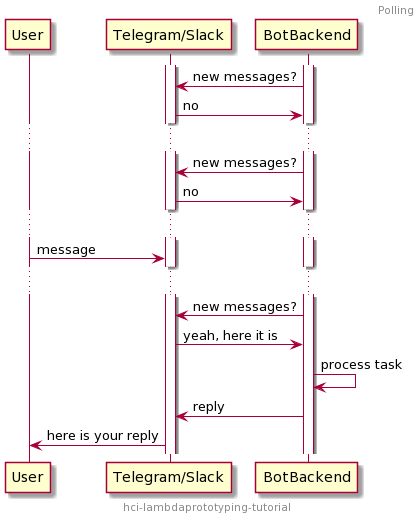
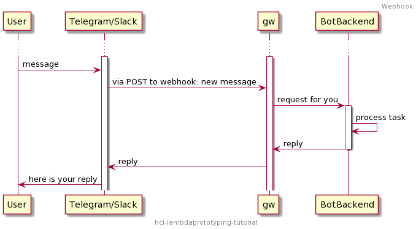

# Architectural intro

## Key ideas

The Serverless or, more specifically, Function-as-a-Service (FaaS) approach is the next logical step of the cloud concept. 
In FaaS, a designer can focus on authoring functions, delegating all responsibilities related to code deployment and execution to the cloud platform.

Most FaaS platforms, including AWS Lambda, provide different ways to execute functions:

- by direct request from user software bindings
- by trigger generated by other cloud services (e.g. on uploading a file to cloud storage)
- by request proxied by RESTful API (using AWS API Gateway in case of AWS)

We will ignore most of software architecture implications and focus only on what does it mean for designers involved in prototyping:

- a quick way to prototype user-facing product logic and bring it to a user via a request-response interface (e.g. WebAPI, messenger-based interface)
- a quick way to connect multiple external cloud (e.g. SaaS) services (with Web API on language bindings) in custom pipelines more sophisticated than Zappier et al
- access to other lower-level cloud services from the same or other platforms, handy to expand prototype or support transition to a product (e.g. file storage service, 
notification and pub-sub services, ML model deployment services, AI APIs (text recognition, sentiment analysis, image, video and voice APIs)) 
- a minimal forward commitment to a particular architecture/infrastructure
- opportunity to develop prototype function by function, limiting cognitive load and prototype development management complexity

On the example of chatbot, let's quickly look at the difference between the one variation of more traditional architecture and FaaS on the case of interacting with some service with API (Telegram/Slack).

In the non-serverless case your backend has an ongoing server process, executed in some environment. It can either response to requests, or make requests to API itself to check for incoming events (polling).

Note, that your responsibility area includes executing and maintaining this ongoing process.

In the FaaS case, your code is executed only then relevant trigger is received. Of course, no magic happens, and there is some `gw` process monitoring for events and triggering your code in time,
but it is not your responsibility anymore.

## Key services and software

- [Chalice](https://aws.github.io/chalice/) - Python framework for quick development of serverless APIs [on AWS Lambda (serverless Flask), abstracting out most of the services complexity
- [AWS Lambda](https://aws.amazon.com/lambda/) - AWS FaaS platform allowing to develop product logic in Python quickly, NodeJS, other platforms
- [AWS API Gateway](https://aws.amazon.com/api-gateway/) - AWS service to map user-facing WebAPI to Lambda calls
- [AWS DynamoDB](https://aws.amazon.com/dynamodb/) - serverless AWS key-value database

## Addtional useful services

- AWS SageMaker - ML model development and deployment service (Jupyter notebook to Web API)
- AWS S3 - simple object file storage

## References

### Serverless Architecture Resources

* [Serverless Architecture with Lambda Best Practices Whitepaper](https://d1.awsstatic.com/whitepapers/serverless-architectures-with-aws-lambda.pdf)
* [Ten things serverless architects should know](https://aws.amazon.com/blogs/architecture/ten-things-serverless-architects-should-know/)
* [How Lambda code is executed in context](https://docs.aws.amazon.com/lambda/latest/dg/runtimes-context.html)
* [Architecture/Business context of transition to Faas](https://acloudguru.com/blog/engineering/evolution-of-business-logic-from-monoliths-through-microservices-to-functions)

### Other cloud services tips

* [AWS to Azure service comparison map](https://docs.microsoft.com/en-us/azure/architecture/aws-professional/services)

--- 

* [Next](030startup.md)
* [Up](../README.md)

---
