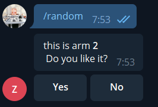
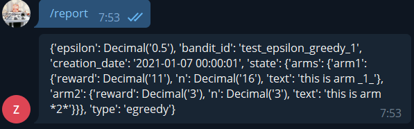

# Bot Goes Bandit

## Random Prompting
As a first step let's randomize what we return to user:

```python
def random_choice1(update: Update, context:CallbackContext) -> None:
    import random
    options = ['arm1', 'arm2']
    prompts = {
      'arm1': 'This is arm *1*',
      'arm2': 'This _is_ arm _2_'
    }
    arm = random.choice(options)
    update.message.reply_text(prompts[arm], parse_mode="Markdown")
```

Don't forget registering handler for command.

This is the first step to bandit, but due to our request-responce architecture, there is no bandit object existing between function calls.

This means that to create a bandit we will need to add persistence and save and restore bandit state to database for each call.

For that we are going to use AWS DynamoDB, serverless key-value db.

## Adding persistence - DynamoDB

See [dynamodb-setup.ipynb](dynamodb-setup.ipynb) for example of creating DynamoDB table and working with storing bandit data in it before running app examples.

Note, that adding DynamoDB seems to require switching to manual access policy, see [config.json](../tg-bandits/.chalice/config.json) and [policy-dev.json](../tg-bandits/.chalice/policy-dev.json), last copied from [J. Olabemiwo tutorial on creating CRUD apps on Lambda](https://auth0.com/blog/how-to-create-crud-rest-api-with-aws-chalice/)

## eGreedy bandit + database

Two handlers in [code](../tg-bandits/app.py), `random_choice_bandit1` & `button` are responsible for bandit interaction:

- `random_choice_bandit1` reads from DynamoDB bandit state, chooses egreedy way a prompt and generates a keyboard to send binary reward.
- `button` processes callback with reward, updating badnit state in DB.



In addition, `report` hadnler returns state of the bandit from DB.



See [inline keyboard example](https://github.com/python-telegram-bot/python-telegram-bot/blob/master/examples/inlinekeyboard.py) to learn more about working with inline keyboards,
callbacks and [advanced example](https://github.com/python-telegram-bot/python-telegram-bot/blob/master/examples/inlinekeyboard2.py) for state-based conversational interaction.

## Task ideas

- Implement other MAB algorithms and extentions (TS, UCB)
- Contextual Bandit and context detection via chatbot for different settings
- Functions for offline learning based on history in DynamoDB
- Prototype texting fixtures: 
    - implement some features to quickly change and load bandit state so not to start from scratch
    - e.g. add 'cheater mode' with commands adding sequence of rewards to some arms, or directly setting up interesting priors


## Advanced references for bandit ideas

- [Tutorial](https://aws.amazon.com/blogs/machine-learning/dynamic-a-b-testing-for-machine-learning-models-with-amazon-sagemaker-mlops-projects/) and [Repo](https://github.com/aws-samples/amazon-sagemaker-ab-testing-pipeline) on AB testing (and bandit testing) SageMaker ML models using bandits on Lambda. No chatbots :)
